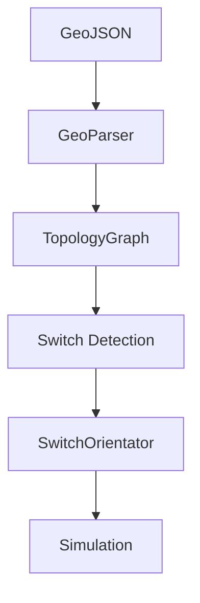

# 🚆 Simulateur Ferroviaire


[](https://azertval.github.io/SimulateurFerroviaire/)

Projet de simulation ferroviaire basé sur un parsing GeoJSON et une reconstruction topologique du réseau ferroviaire.

---

# 📊 Pipeline



---

# ⚙️ Prérequis

* Windows 10/11
* Visual Studio 2022 ou Visual Studio Insiders
* CMake ≥ 3.20

### Workloads requis

* ✔ Desktop development with C++

### Composants nécessaires

* ✔ MSVC (v143 ou v180)
* ✔ Windows SDK
* ✔ CMake tools

---

# 🛠️ Première compilation

## 1. Cloner le projet

```bash
git clone <repo_url>
cd SimulateurFerroviaire
```

---

## 2. Générer le projet

### Visual Studio 2022

```bash
cmake -B build -S . -G "Visual Studio 17 2022" -A x64
```

### Visual Studio Insiders

```bash
cmake -B build -S . -G "Visual Studio 18 2026" -A x64
```

---

## 3. Compiler

```bash
cmake --build build --config Debug
```

---

## 4. Exécuter

```text
build/Debug/SimulateurFerroviaire.exe
```

---
## 📚 Documentation

La documentation du projet est générée avec **Doxygen**.
👉 Ouvrir la documentation : https://azertval.github.io/SimulateurFerroviaire/

## Génération

```bash
doxygen Doxyfile
```

---

# 📁 Structure du projet

TODO

---

# 🧪 CI / Build automatique

Le projet utilise GitHub Actions :

* Compilation automatique des Pull Requests
* Validation du build

---

# 🐞 Dépannage

## ❌ Toolset MSVC introuvable

Installer :

* Desktop development with C++
* MSVC toolset

---

## ❌ Erreur `main` non trouvé

Le projet est une application Win32 :

```cmake
add_executable(SimulateurFerroviaire WIN32 ...)
```

---

## ❌ Pas de .exe généré

Vérifier le dossier :

```text
build/Debug/
```

---

## ❌ Erreur CMake (generator mismatch)

```bash
rm -rf build
```

---

# 🧩 Bonnes pratiques

* Ne pas modifier les fichiers `.vcxproj`
* Toujours utiliser CMake
* Faire un clean build en cas de problème

---

# 🚀 Roadmap

* [ ] Visualisation graphique du réseau
* [ ] Simulation de circulation
* [ ] Tests unitaires
* [ ] Optimisation du graphe

---

# 🤝 Contribution

1. Fork
2. Créer une branche
3. Pull Request

---

# 📜 Licence

À définir

---

# ✨ Auteur

Valentin Eloy
