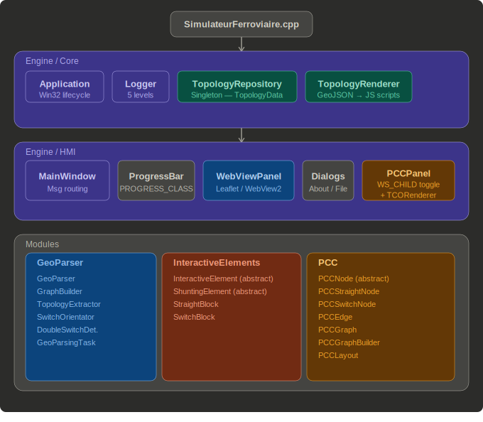

@tableofcontents

---

# Description {#description}

Reconstruction et visualisation d'un réseau ferroviaire à partir de données GeoJSON.

Le projet repose sur un pipeline de parsing permettant de :
- Charger des données géographiques (WGS-84 / GeoJSON)
- Construire un graphe topologique métrique (UTM)
- Extraire les blocs ferroviaires (voies droites + aiguillages)
- Orienter et valider les aiguillages (root / normal / deviation)
- Détecter les doubles aiguilles et absorber les segments de liaison
- Résoudre les pointeurs inter-blocs et construire les index de lookup
- Stocker le modèle dans un singleton partagé et le visualiser dans un WebView
- Permettre une interaction bidirectionnelle Leaflet ↔ C++ (clic → mise à jour modèle → rendu)
- Afficher une vue PCC type TCO SNCF superposée à la carte, togglable via F2

---

# Architecture du projet {#diag}

---

# Documentation

- @subpage engine   — Moteur de l'application (Core + HMI)
- @subpage modules  — Fonctionnalités métier (GeoParser + InteractiveElements + Coordonnées)
- @subpage pcc      — Module PCC (graphe logique + rendu TCO)
- @subpage references — Références externes, licence et auteur
