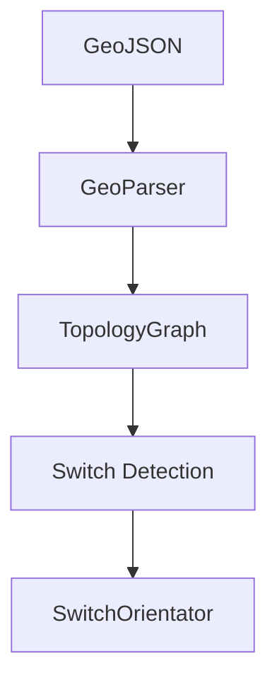

# Simulateur Ferroviaire

## 🚆 Description

Le projet **Simulateur Ferroviaire** permet de reconstruire un réseau ferroviaire à partir de données GeoJSON.

Il s'appuie sur :

* Un parsing géographique (WGS-84)
* Une reconstruction topologique (graphe)
* Une détection et orientation des aiguillages

---

## 📊 Pipeline

---

## 🧱 Modules

* **GeoParser** : lecture GeoJSON
* **TopologyGraph** : graphe ferroviaire
* **SwitchBlock** : modélisation aiguillages
* **SwitchOrientator** : orientation

---

## 📐 Concepts clés

* Coordonnées WGS-84 (`LatLon`)
* Distance Haversine
* Graphe planaire
* Orientation géométrique

---

## 👨‍💻 Auteur

Valentin Eloy
